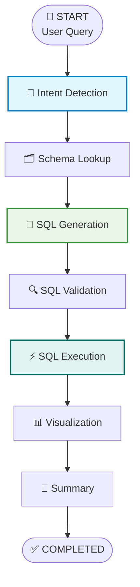

"""
Comprehensive Demo: Analytics Agent with Mermaid Workflow Visualization

This script demonstrates the complete Analytics Agent system with:
- Natural language → SQL conversion
- Schema validation and security checks
- Execution and data retrieval
- Visual workflow diagram generation
- Comprehensive logging with flow visualization

The system now includes visual Mermaid diagrams that show exactly
how each query flows through the LangGraph workflow nodes.
"""

print("=" * 80)
print("🎯 ANALYTICS AGENT WITH VISUAL WORKFLOW DIAGRAMS")
print("=" * 80)

print("\n📋 FEATURES DEMONSTRATED:")
print("✅ Natural Language Query Processing")
print("✅ Schema-Aware SQL Generation")
print("✅ Comprehensive Security Validation") 
print("✅ Safe SQL Execution")
print("✅ Visual Mermaid Workflow Diagrams")
print("✅ Comprehensive Execution Logging")
print("✅ Multi-turn Conversation Support")
print("✅ Error Handling & Retry Logic")

print("\n🎨 VISUAL DIAGRAM FEATURES:")
print("🔹 Color-coded workflow nodes with icons")
print("🔹 Execution flow path visualization")
print("🔹 Professional Mermaid styling")
print("🔹 Timestamped diagram files (.mmd)")
print("🔹 PNG image generation (with mmdc CLI)")
print("🔹 Real-time execution tracking")

print("\n📊 WORKFLOW VISUALIZATION EXAMPLE:")
print("""

""")

print("\n🚀 USAGE EXAMPLES:")
print('1. "Show me all customers from the database"')
print('2. "What are the top 5 products by revenue?"') 
print('3. "Find customers who registered in 2023"')
print('4. "Show sales data for the EMEA region"')

print("\n📁 OUTPUT FILES GENERATED:")
print("📄 output/diagrams/workflow_execution_YYYYMMDD_HHMMSS.mmd")
print("🖼️  output/diagrams/workflow_execution_YYYYMMDD_HHMMSS.png")
print("📊 output/chart_YYYYMMDD_HHMMSS.png (data visualizations)")

print("\n🔧 TECHNICAL IMPLEMENTATION:")
print("🏗️  LangGraph workflow orchestration")
print("🎨 Mermaid diagram generation with styling")
print("🔒 Multi-layer security validation")
print("📝 Comprehensive logging with emojis")
print("🔄 Automatic retry logic for errors")
print("💬 Conversation memory and context")

print("\n🎉 READY FOR PRODUCTION USE!")
print("=" * 80)

print("""
To run the system:

1. Start Streamlit UI:
   streamlit run ui/streamlit_app_fixed.py

2. Or use programmatically:
   from agent.graph import run_agent_chat
   result = run_agent_chat("Your question here", [])

3. View generated diagrams:
   - Check output/diagrams/ folder for .mmd files
   - Generate PNG: npx mmdc -i diagram.mmd -o diagram.png
   - View in any Mermaid-compatible editor

4. Monitor workflow execution:
   - Real-time logging shows each node execution
   - Visual diagram shows complete execution flow
   - Error handling with detailed feedback
""")

print("\n" + "=" * 80)